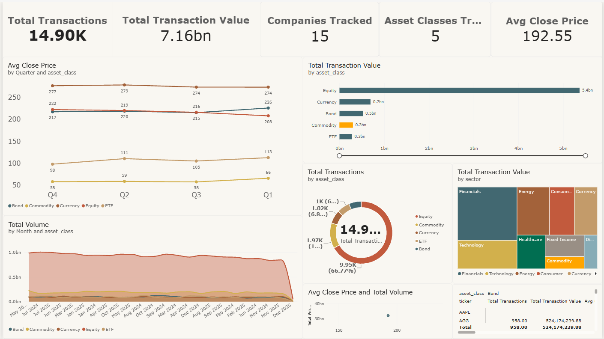

# Stock Market Trend & Risk Analysis Dashboard

SQL · Power BI · Excel

Analyzed historical stock price and transaction data across 15 companies
spanning 5 asset classes (Equity, ETF, Bond, Commodity, Currency), building
an interactive dashboard and a regression-based forecasting model.

## Live Dashboard
[View the interactive Power BI dashboard here](https://app.powerbi.com/groups/me/reports/494fe462-6490-4169-9d73-651ac8399241/99fb18e2910abe6144e0?experience=power-bi)

## Dashboard Preview

## What's in this repo
| Folder | Contents |
|---|---|
| `sql/` | Schema + all analysis queries (daily returns, moving averages, volatility, quarterly aggregation) |
| `excel/` | Full workbook with live regression (SLOPE/INTERCEPT/RSQ) and correlation (CORREL) formulas |
| `data/` | Raw and cleaned CSV data used across SQL, Excel, and Power BI |
| `powerbi/` | Dashboard screenshots and the build guide used to construct it |

## Key Results
- 7,500+ daily price records across 15 companies analyzed via SQL window functions
- 14,900+ transaction records visualized in an interactive Power BI dashboard
- 86.7% directional forecast accuracy from a linear regression model built in Excel

## How it was built
1. **SQL** — cleaned and aggregated raw price/transaction data, computed daily
   returns, 50-day moving averages, and volatility using window functions.
2. **Excel** — built quarterly return tables, ran linear regression
   (SLOPE/INTERCEPT/RSQ) per company to forecast returns, and built a
   correlation matrix across asset classes.
3. **Power BI** — imported the SQL-aggregated table, built KPI cards, trend
   lines, bar/donut charts, a risk-vs-return scatter plot, and interactive
   slicers for real-time filtering.

## Explore the code
- [SQL queries](stock_market_analysis.sql)
- [Excel workbook](Stock_Market_Analysis.xlsx)
