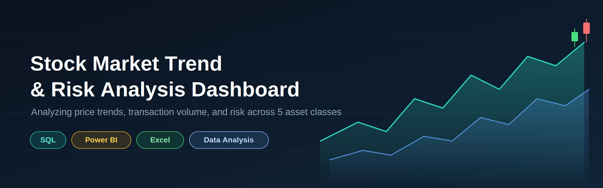
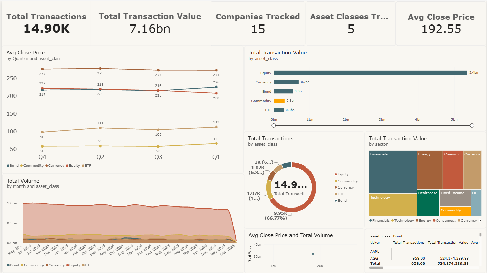

# Stock Market Trend & Risk Analysis Dashboard


SQL · Power BI · Excel

Analyzed historical stock price and transaction data across 15 companies
spanning 5 asset classes (Equity, ETF, Bond, Commodity, Currency), building
an interactive dashboard and a regression-based forecasting model.

## Live Dashboard
[View the interactive Power BI dashboard here](https://app.powerbi.com/groups/me/reports/494fe462-6490-4169-9d73-651ac8399241/99fb18e2910abe6144e0?experience=power-bi)

## Dashboard Preview



## What's in this repo
| Folder | Contents |
|---|---|
| `sql/` | Schema + all analysis queries (daily returns, moving averages, volatility, quarterly aggregation) |
| `excel/` | Full workbook with live regression (SLOPE/INTERCEPT/RSQ) and correlation (CORREL) formulas |
| `data/` | Raw and cleaned CSV data used across SQL, Excel, and Power BI |
| `powerbi/` | Dashboard screenshots and the build guide used to construct it |

## 🗄️ SQL Queries & Results

### 1. Data Validation
```sql
SELECT
    COUNT(*) AS total_rows,
    MIN(trade_date) AS earliest_date,
    MAX(trade_date) AS latest_date,
    COUNT(DISTINCT company_id) AS total_companies
FROM stock_prices;
```


### 2. Daily Returns per Company
```sql
SELECT
    company_id,
    trade_date,
    close_price,
    LAG(close_price) OVER (PARTITION BY company_id ORDER BY trade_date) AS prev_close,
    ROUND(
        (close_price - LAG(close_price) OVER (PARTITION BY company_id ORDER BY trade_date))
        / LAG(close_price) OVER (PARTITION BY company_id ORDER BY trade_date) * 100, 2
    ) AS daily_return_pct
FROM stock_prices;
```


### 3. 50-Day Moving Average (Trend Signal)
```sql
SELECT
    company_id,
    trade_date,
    close_price,
    AVG(close_price) OVER (
        PARTITION BY company_id
        ORDER BY trade_date
        ROWS BETWEEN 49 PRECEDING AND CURRENT ROW
    ) AS moving_avg_50d
FROM stock_prices;
```


### 4. Yearly Growth Ranking Across All Companies
```sql
SELECT
    c.ticker,
    c.company_name,
    EXTRACT(YEAR FROM sp.trade_date) AS trade_year,
    ROUND(
        (MAX(sp.close_price) - MIN(sp.close_price)) / MIN(sp.close_price) * 100, 2
    ) AS yearly_growth_pct
FROM stock_prices sp
JOIN companies c ON c.company_id = sp.company_id
GROUP BY c.ticker, c.company_name, EXTRACT(YEAR FROM sp.trade_date)
ORDER BY yearly_growth_pct DESC;
```


### 5. Volatility / Risk per Company (Std Dev of Daily Returns)
```sql
WITH daily_returns AS (
    SELECT
        company_id,
        trade_date,
        (close_price - LAG(close_price) OVER (PARTITION BY company_id ORDER BY trade_date))
        / LAG(close_price) OVER (PARTITION BY company_id ORDER BY trade_date) AS daily_return
    FROM stock_prices
)
SELECT
    c.ticker,
    c.asset_class,
    ROUND(STDDEV(dr.daily_return) * 100, 3) AS volatility_pct
FROM daily_returns dr
JOIN companies c ON c.company_id = dr.company_id
WHERE dr.daily_return IS NOT NULL
GROUP BY c.ticker, c.asset_class
ORDER BY volatility_pct DESC;
```


### 6. Daily Transaction Volume & Value by Asset Class
```sql
SELECT
    trade_date,
    asset_class,
    COUNT(transaction_id) AS total_transactions,
    SUM(quantity * price) AS total_transaction_value
FROM transactions
GROUP BY trade_date, asset_class
ORDER BY trade_date;
```


### 7. Buy vs Sell Breakdown
```sql
SELECT
    asset_class,
    transaction_type,
    COUNT(*) AS num_transactions,
    SUM(quantity) AS total_quantity
FROM transactions
GROUP BY asset_class, transaction_type;
```


### 8. Top 10 Most Actively Traded Companies
```sql
SELECT
    c.ticker,
    c.asset_class,
    COUNT(t.transaction_id) AS num_transactions,
    SUM(t.quantity) AS total_volume
FROM transactions t
JOIN companies c ON c.company_id = t.company_id
GROUP BY c.ticker, c.asset_class
ORDER BY total_volume DESC
LIMIT 10;
```


### 9. Quarterly Returns per Company (Exported for Excel Regression)
```sql
SELECT
    c.ticker,
    EXTRACT(YEAR FROM sp.trade_date) AS trade_year,
    EXTRACT(QUARTER FROM sp.trade_date) AS trade_quarter,
    ROUND(
        (MAX(sp.close_price) - MIN(sp.close_price)) / MIN(sp.close_price) * 100, 2
    ) AS quarterly_return_pct
FROM stock_prices sp
JOIN companies c ON c.company_id = sp.company_id
GROUP BY c.ticker, EXTRACT(YEAR FROM sp.trade_date), EXTRACT(QUARTER FROM sp.trade_date)
ORDER BY c.ticker, trade_year, trade_quarter;
```


## Key Results
- 7,500+ daily price records across 15 companies analyzed via SQL window functions
- 14,900+ transaction records visualized in an interactive Power BI dashboard
- 86.7% directional forecast accuracy from a linear regression model built in Excel

## How it was built
1. **SQL** — cleaned and aggregated raw price/transaction data, computed daily
   returns, 50-day moving averages, and volatility using window functions.
2. **Excel** — built quarterly return tables, ran linear regression
   (SLOPE/INTERCEPT/RSQ) per company to forecast returns, and built a
   correlation matrix across asset classes.
3. **Power BI** — imported the SQL-aggregated table, built KPI cards, trend
   lines, bar/donut charts, a risk-vs-return scatter plot, and interactive
   slicers for real-time filtering.

## Explore the code
- [SQL queries](stock_market_analysis.sql)
- [Excel workbook](Stock_Market_Analysis.xlsx)
